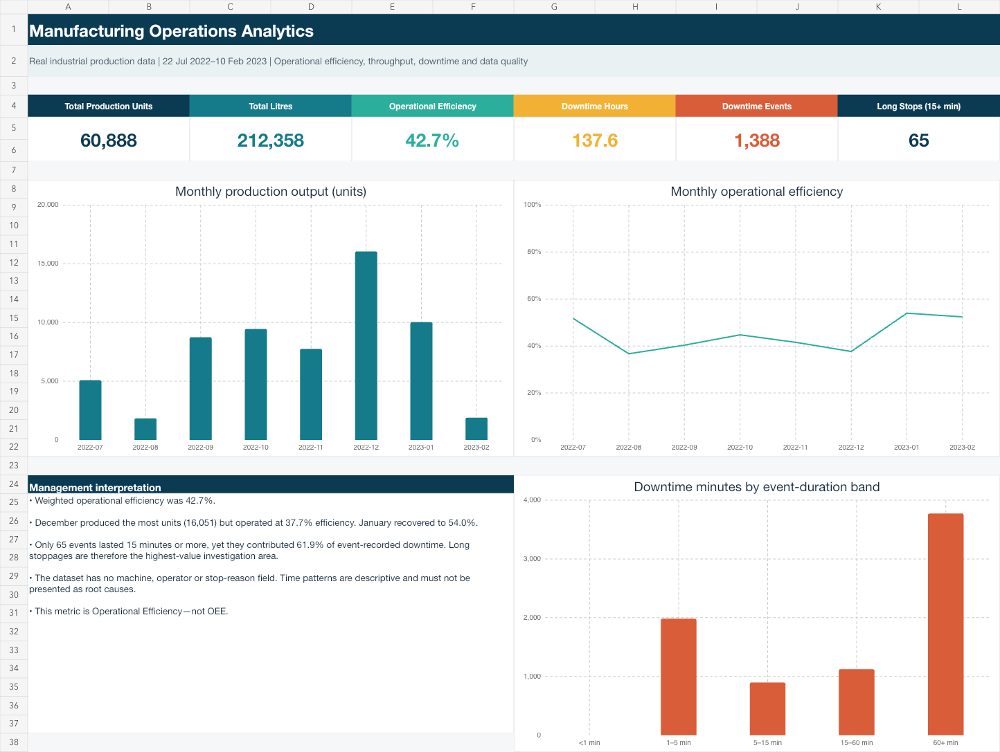
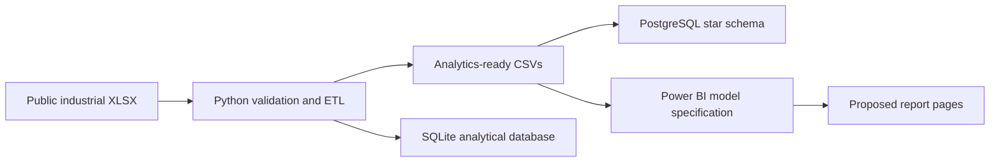
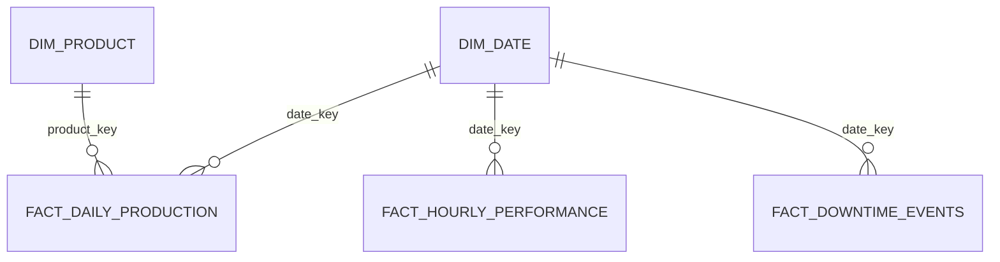

# Manufacturing Operations Analytics

[](https://www.python.org/)
[](https://github.com/agbajames/manufacturing-operations-analytics/actions/workflows/ci.yml)
[](LICENSE)

An end-to-end manufacturing analytics project that uses Python and SQL to transform real industrial filling-line data into an auditable star schema for production, efficiency and downtime analysis. The repository also includes a Power BI model and report specification; it does not include a `.pbix` file or a deployed report.



## Implementation status

Completed deliverables include the tested ETL pipeline, processed star-schema tables, SQLite database, PostgreSQL scripts, analytical review workbook, reusable DAX measures, and a documented Power BI build specification. A Power BI Desktop file and Power BI Service deployment are outside the scope of this repository.

## Business problem

Production managers need to understand where monitored time is being lost, whether throughput and operating efficiency are improving, and whether a small number of long stoppages account for disproportionate downtime.

This project answers:

1. How much was produced, and how efficiently was monitored time used?
2. How do output, operating time and downtime change by month, product and hour?
3. Are downtime losses driven by frequent short stops or infrequent long stops?
4. Which data-quality conditions must be resolved before operational decisions are made?

## Headline findings

- The source covers **56 production days** from 22 July 2022 to 10 February 2023, with **60,888 containers** and **212,358 litres** produced.
- Weighted operational efficiency was **42.7%**, calculated as operating hours divided by monitored hours. It is not an unweighted average of daily percentages.
- December delivered the highest monthly output at **16,051 units**, but operational efficiency was only **37.7%** across 15 production days. January recovered to **54.0%**.
- The event log contains **1,388 stoppages**. Median duration was **1.5 minutes**, while the maximum was nearly **350 minutes**, showing a strongly right-skewed loss pattern.
- Only **65 events** lasted at least 15 minutes, but they contributed **61.9% of event-recorded downtime**. This makes long-stop reduction a higher-value investigation than treating every event equally.
- The ETL identified six duplicate raw hourly records, 16 hour keys present in only one hourly source, and 15 daily time-reconciliation warnings. These remain visible in the governed output.

These findings are descriptive. The source has no stop-reason, machine or operator fields, so the analysis does not claim root causes.

## Architecture



## Data model



The facts are deliberately not joined to one another. Shared dimensions filter each fact at its own grain.

## Repository structure

```text
manufacturing-operations-analytics/
├── assets/                         # Analytical workbook preview
├── data/
│   ├── raw/                        # Licensed source workbook
│   ├── processed/                  # Power BI-ready star-schema tables
│   └── manufacturing_analytics.sqlite
├── docs/                           # Data dictionary and limitations
├── powerbi/                        # DAX, theme and implementation guide
├── sql/                            # PostgreSQL DDL, views and load script
├── src/etl.py                      # Reproducible transformation pipeline
├── tests/test_etl.py               # Automated quality and relationship tests
├── Manufacturing_Operations_Analytics.xlsx
└── requirements.txt
```

## Reproduce the project

Create a virtual environment, install the requirements, and run:

```bash
python src/etl.py
python -m unittest discover -s tests -v
```

The ETL verifies the source MD5 before processing. It writes seven CSV outputs, an analysis summary and a SQLite database.

## Implement the Power BI specification

1. Follow `powerbi/model-and-build-guide.md`.
2. Import the processed CSVs or the analytical workbook.
3. Create the relationships exactly as specified.
4. Add the measures from `powerbi/measures.dax`.
5. Import `powerbi/theme.json`.
6. Build the four report pages and validate the headline totals against this README.

The specification uses **Operational Efficiency**, not OEE. Full OEE would require ideal-cycle and quality/reject data that the public source does not provide.

## Data source and licence

David, G. A., Monson, P. M. C., & Soares Junior, C. *Industrial Production Time-Series Dataset from a Beverage Bottling Line*. Zenodo. https://doi.org/10.5281/zenodo.18146866

The dataset is licensed under CC BY 4.0. Full attribution and the verified checksum are recorded in `LICENSE-DATA.md`.
